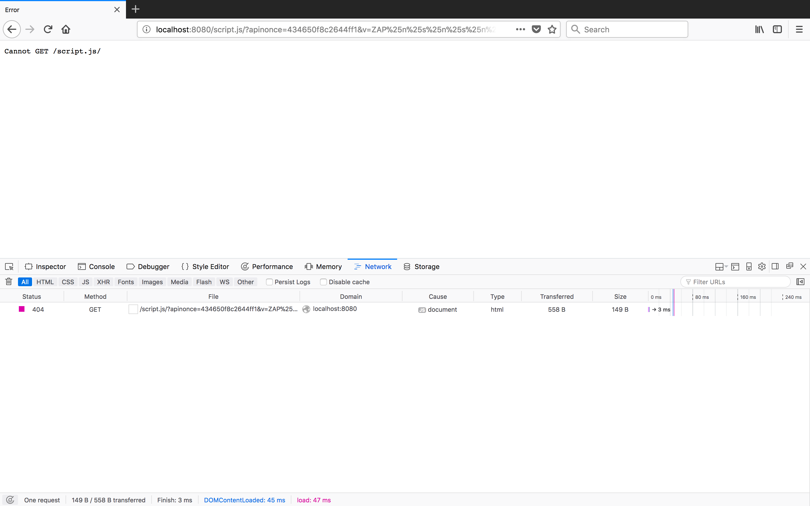

# Security Scan Summary

The following reports were created by OWASP ZAP 2.6 against local instances of
the API and web client.

## API

Results: [ZAP Scanning Report](api.pdf)

The 3 potential format string errors apper to be false positives, as we are able
to visit the URLs and receive a 404 response, as expected. The CORS headers are being set for the API in the middleware: https://github.com/18F/fs-permit-platform/blob/master/server/src/services/middleware.es6

## Web client

Results: [ZAP Scanning Report](frontend.pdf)

X-Frame-Options and X-XSS-Protection headers will be set by the production web
server. The deliverables from the frontend section are static files without any
specific web server configurations.
